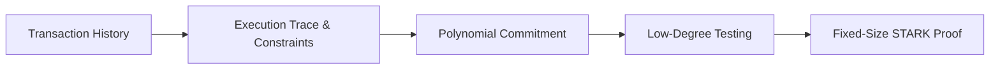

# zk-RGB Deep Dive: Scaling L2 Asset System with Zero-Knowledge Proofs

## Introduction

The RGB protocol has emerged as one of the most promising Layer 2 solutions for Bitcoin, enabling complex smart contracts and token issuance without modifying the base layer. However, as adoption grows, the inefficiency of verifying state transitions across RGB’s directed acyclic history data has become a critical bottleneck.  

This challenge was recently formalized in the RGB Working Group’s *STARKy RGB* proposal ([Discussion #265](https://github.com/orgs/RGB-WG/discussions/265)), which identified zk-STARKs as the optimal solution due to their poly-logarithmic verification time, quantum resistance, and compatibility with AluVM’s register-based architecture. This article explores how zero-knowledge proofs—specifically ZK-STARKs—can address these limitations by revolutionizing RGB’s verification model, enabling succinct proof of state integrity without compromising its trustless design.  

## Architecture Overview



The zk-RGB architecture transforms the entire RGB state transition history into a succinct, verifiable proof through a series of mathematical transformations. This approach allows new participants to verify the correctness of the current state without processing the entire history.

### **Key Components**

1. **Execution Trace Generation**  
   - Package transaction history (state transition DAG) into an execution trace.  
   - Each verifiable state is compressed into an 8-field tuple (some states omitted for efficiency).
   - The trace captures all relevant information needed to verify state transitions.

2. **Constraint System**  
   - Use **AluVM** programs as constraints, leveraging RGB's existing virtual machine.
   - These constraints encode the rules that valid state transitions must follow.

3. **Polynomial Commitment**  
   - Encode the execution trace into polynomials for efficient verification.
   - Allows for compact representation of complex state transitions.

4. **Low-Degree Testing (FRI)**  
   - Prove polynomial degrees are below a threshold, ensuring proofs are genuine.
   - Provides cryptographic guarantees without trusted setup.

## Principle Details

### Execution Trace Construction

The first step in generating a zk-STARK proof is converting the RGB transaction history into a structured execution trace. This trace represents the step-by-step evolution of the system state.

**Encode N transactions into a trace table**:

- Each row represents a state transition step.
- Each column represents a state variable (balance, nonce, etc.).
- The trace captures all information needed to verify the correctness of transitions.

**Example Trace Table (Simplified)**:

```
| Step | Balance | Nonce | Validity Flag |
|------|---------|-------|---------------|
| 0    | 1000    | 0     | -             |
| 1    | 1200    | 1     | 1 (Valid)     |
| 2    | 900     | 2     | 1             |
| ...  | ...     | ...   | ...           |
| N    | 3500    | N     | 1             |
```

A key challenge in RGB is that transactions are non-linear (e.g., multiple inputs, splits, merges). To address this, although the specific plan has not yet been determined, here are some ideas:

1. Process all input sequences in parallel and merge at appropriate points
2. Segment the trace at split points and generate separate proofs for each segment

Importantly, **full transaction history is optional**—incremental proofs can be generated from intermediate states, allowing for efficient updates without recomputing the entire history.

### Polynomial Interpolation

After constructing the execution trace, we convert each **column** into a polynomial:

- Find the minimal-degree polynomial over field 𝔽 that interpolates all points (x=ωⁱ, y=column value).
- This transformation is crucial for enabling the subsequent zero-knowledge proof steps.

**Mathematical Formulation**:

```
For column data [b₀, b₁, ..., b_N], construct polynomial B(x) such that:
B(ω⁰) = b₀, B(ω¹) = b₁, ..., B(ωᴺ) = b_N,
where ω is a root of unity.
```

**Example**: Consider a balance column with values [10, 12, 15, 11]:

1. Find 4th root of unity ω in the field.
2. Solve the system: B(1)=10, B(ω)=12, B(ω²)=15, B(ω³)=11.
3. Result: B(x) = 10 + 2x + 3x² - 4x³.

**Domain Extension**:

- Let expansion factor ρ=1/4. Original domain size=4 → extended domain size=16.
- Evaluate B(x) on the extended domain, build a Merkle tree from the evaluations.  
- **Purpose**: This provides zero-knowledge properties, security against forgery, and enables the FRI protocol for efficient verification.

### Constraint System Encoding

The business logic of RGB contracts must be translated into algebraic constraints that can be verified within the STARK framework:

**Example Transition Constraints (Rust Pseudocode)**:

Here we demonstrates the possible behavior of constraint functions:

```rust
fn transition_constraints(
    current: &[FieldElement], 
    next: &[FieldElement],
    tx: &Transaction
) -> Vec<FieldElement> {
    vec![
        // Constraint 1: Nonce increments by 1
        next[1] - (current[1] + 1),
        
        // Constraint 2: Balance matches transaction amount
        next[0] - (current[0] + tx.amount),
        
        // Constraint 3: Validity flag must be 1
        next[2] - 1
    ]
}
```

For the specific situation of RGB, these constraints would be elegantly delegated to **AluVM** for programmatic validation, allowing for complex contract logic while maintaining the efficiency of the proof system. This approach leverages RGB's existing virtual machine infrastructure while enabling zero-knowledge capabilities.

### Polynomial Commitment

To make the polynomials verifiable without revealing their coefficients, we commit to them via Merkle trees:

1. Evaluate polynomials on an extended domain (typically 8–32× expansion).
2. Build a Merkle tree from these evaluations.
3. The root hash serves as the commitment to the polynomial.

```
B(x) → Evaluations on {ω⁰, ω¹, ..., γⁱ} → Merkle Tree → Root Hash
```

This commitment scheme allows the verifier to check specific evaluations without seeing the entire polynomial, maintaining both efficiency and privacy.

### FRI Low-Degree Testing

The Fast Reed-Solomon Interactive Oracle Proof of Proximity (FRI) protocol is the heart of the STARK system. It proves that:

- All constraint polynomials are of low degree (i.e., the claimed degree bound is honest).
- The execution trace satisfies all constraints.

**Two-Phase Process**:

1. **Commitment Phase**:
   - Prover commits to initial polynomial f₀(x).
   - Verifier sends randomness r₀.
   - Prover computes f₁(x²) = (f₀(x) + f₀(-x))/2 + r₀(f₀(x) - f₀(-x))/(2x).
   - This process repeats, halving the degree each time, until achieving a sufficiently low degree.

2. **Verification Phase**:
   - Verifier randomly samples points across layers.
   - Consistency between layers is verified using the committed values.

**FRI Workflow**:


The FRI protocol provides exponential security with only logarithmic verification cost, making it ideal for RGB's scalability needs.

## Verification Process

New users in the asset network can verify the correctness of the current state without processing the entire history by:

1. **Checking Public Inputs**:

```rust
assert_eq!(proof.public_inputs.initial_balance, GENESIS_BALANCE);
assert_eq!(proof.public_inputs.final_balance, latest_balance);
```

2. **Validating Constraints**:
   - Verify that all constraint polynomials are low-degree (via FRI).
   - Check that boundary constraints are satisfied.

3. **Random Sampling**:
   - Request Merkle proofs for random positions in the execution trace.
   - Confirm that the evaluations match the commitment.

This verification process is extremely efficient, requiring only O(log N) time regardless of how many transactions have occurred in the system's history.

## Time Complexity Analysis

| **Proof Generation**     | Time       | Space    |
| ------------------------ | ---------- | -------- |
| Execution Trace          | O(N)       | O(N)     |
| Polynomial Interpolation | O(N log N) | O(N)     |
| Constraint Evaluation    | O(N·C)     | O(C)     |
| FRI Protocol             | O(N log N) | O(log N) |
| Merkle Tree Construction | O(N)       | O(N)     |

| **Verification**         | Time     | Space |
| ------------------------ | -------- | ----- |
| FRI Verification         | O(log N) | O(1)  |
| Merkle Path Verification | O(log N) | O(1)  |
| Constraint Check         | O(1)     | O(1)  |

The asymptotic improvement from O(N) verification time to O(log N) represents a transformative efficiency gain for the RGB ecosystem, especially as transaction volumes scale.

## FRI Protocol: Technical Foundation

**Reed-Solomon Codes** form the cryptographic foundation of FRI's security. Compared to simpler error-correcting codes:

- **RS Codes** can correct up to ⌊(n−k)/2⌋ symbol errors (e.g., 2-byte errors for RS(15,10)).
- **Hamming Codes** correct only 1-bit errors.

STARKs leverage Reed-Solomon codes for polynomial interpolation and error detection, providing robust security guarantees even against quantum adversaries.

## Practical Implications for RGB

The integration of ZK-STARKs into RGB offers several compelling advantages:

1. **Scalability**: Verification time becomes logarithmic rather than linear in the number of transactions.
2. **Privacy**: Transaction details can remain private while still proving correctness.
3. **Interoperability**: Compact proofs can be easily shared across different systems.
4. **Reduced Storage**: Nodes need only store the latest state and proof, not the entire history.

These benefits position RGB to become a more competitive Layer 2 solution in the broader blockchain ecosystem, particularly for applications requiring high throughput and privacy.

## Current Development Status

While the theoretical framework for zk-RGB is sound, it's important to note that RGB has not yet officially implemented ZK proof generation/verification in production. Current development efforts focus on preparatory work such as:

- Execution trace generation for RGB state transitions
- Constraint system construction compatible with AluVM
- Integration points with the existing RGB protocol

A full implementation remains a work in progress, with significant research and engineering challenges still to be addressed.

## Conclusion

Using **ZK-STARKs** to compress transaction history proofs represents a promising direction for scaling RGB's smart contract capabilities. The proof generation complexity of **O(N·C)** and verification complexity of **O(log N)** offer significant efficiency improvements compared to the original O(N) verification time.

The ability to generate incremental proofs could further enhance performance, greatly boosting RGB's practicality for producation applications. As the RGB ecosystem continues to mature, the integration of zero-knowledge proofs stands to dramatically expand its potential use cases while maintaining Bitcoin's core values of security, decentralization, and trustlessness.

The road ahead involves substantial technical challenges, but the potential rewards—a more scalable, private, and efficient smart contract layer for Bitcoin—make this an exciting frontier for blockchain development.
